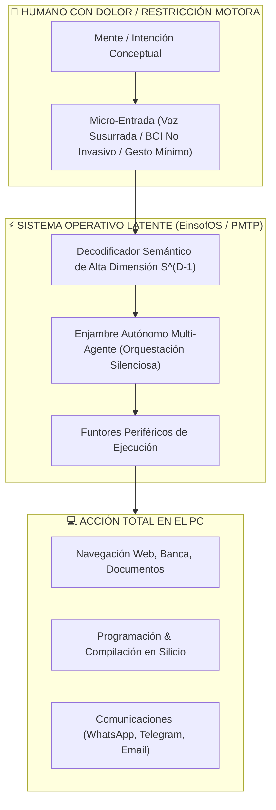

# 🏛️ CAPÍTULO DE ACCESIBILIDAD UNIVERSAL, NEURODIVERSIDAD Y EMANCIPACIÓN BIOMECÁNICA EN POLYDIM

**Autor y Fundador:** Ariel García Traba  
**Iniciativa:** POLYDIM / EinsofOS Research Initiative  
**Clasificación:** Manifiesto de Impacto Humano, Salud y Neurotecnología  
**Fecha:** Septiembre de 2026  

---

## 1. LA TRAGEDIA BIOMECÁNICA DE VON NEUMANN: EL DOLOR FÍSICO COMO BARRERA COGNITIVA

La arquitectura computacional moderna fue concebida bajo una premisa excluyente: que el ser humano debe interactuar con la máquina a través de la tensión biomecánica repetitiva de sus extremidades superiores (teclear caracteres discretos uno a uno, presionar botones y arrastrar un ratón).

Para millones de personas en el mundo afectadas por **dolor crónico, fibromialgia, neuropatías periféricas, artritis reumatoide, distrofias musculares o lesiones medulares**, esta interfaz háptica 1D no es solo ineficiente: **es una fuente constante de tortura física y agotamiento neuroquímico**.

> *"Tipear durante horas cuando cada articulación y terminación nerviosa envía señales de dolor intenso es la mayor evidencia del fracaso de la interfaz humano-computadora tradicional. La mente humana piensa en conceptos complejos y continuos, pero está condenada a martillar teclas mecánicas para hacerse entender por una máquina."* — **Ariel García Traba**

---

## 2. POLYDIM COMO PRÓTESIS COGNITIVA CONTINUA: DE LA FRICCIÓN MOTORA A LA FLUIDEZ LATENTE

POLYDIM redefine la relación entre el cuerpo, la mente y el computador. Al eliminar la exigencia del "Gusano 1D" (deletreo forzado y serialización textual manual), se habilitan tres niveles de emancipación biomecánica:

### Principios Fundamentales de la Accesibilidad en POLYDIM:

1. **Eficiencia Entrópica de Esfuerzo (Amplificación Cognitiva):**  
   Una sola palabra, un susurro o un micropulso neuronal es capturado como un vector en $S^{D-1}$. El orquestador expande la intención a través de los funtores periféricos, ejecutando cientos de líneas de código, trámites o comunicaciones complejas sin requerir miles de pulsaciones de teclas.
2. **Independencia del Hardware de Entrada (Agnosticismo Háptico):**  
   El usuario no necesita tocar el teclado ni el ratón. Puede operar el PC mediante voz fluida de baja latencia (Whisper local + Piper), rastreo ocular (Eye-tracking), interfaces EMG de muñeca de esfuerzo casi nulo, o vinchas EEG/BCI no invasivas.
3. **Erradicación del Castigo por Fatiga:**  
   En los sistemas tradicionales, cansarse físicamente detiene la producción intelectual. En POLYDIM, el enjambre asume el trabajo pesado de computación, memoria compartida y verificación destructiva, devolviendo autonomía total al creador.

---

## 3. COMPROMISO ÉTICO Y SOCIAL DE LA TESIS

La tecnología no debe ser un privilegio para cuerpos intactos. POLYDIM se compromete formalmente con la **emancipación de las personas con discapacidades motoras y enfermedades crónicas**, garantizando que el acceso a la Inteligencia Artificial sea un puente de liberación física, donde el dolor corporal nunca más limite el alcance del intelecto humano.
