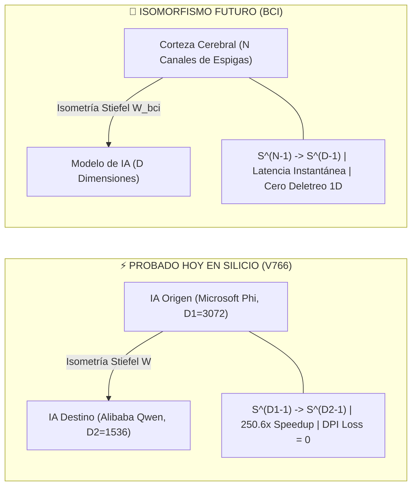

# 🧠 EL ISOMORFISMO FUNDAMENTAL: DE LA TELEPATÍA IA ↔ IA AL ACOPLAMIENTO CEREBRO ↔ IA

**Ubicación Teórica:** Capítulo de Proyecciones Futuras y Límites de la Arquitectura (Tesis Doctoral POLYDIM)  
**Autor:** Ariel García Traba  
**Estado:** Formulación Teórica / Horizonte Experimental  

---

## 1. 🎯 ENCUADRE EPISTEMOLÓGICO: LO ACTUAL VS LO FUTURO

* **Prioridad Operativa Inmediata (Ingeniería de Producción):**  
  Comunicación nativa entre IAs (**LatentMAS / PMTP**), aceleración en silicio heterogéneo (CPU, GPU CUDA/Triton, TPU, Cerebras WSE), automatización omni-canal del PC y prótesis cognitiva de baja fricción motora para personas con dolor crónico.
* **Proyección Teórica a Futuro (Horizonte BCI):**  
  El hardware comercial de decodificación cerebral de alta densidad (Neuralink, Synchron, Precision Neuroscience) se encuentra en fase clínica y de desarrollo temprano. Sin embargo, **la arquitectura matemática de POLYDIM no requiere modificaciones conceptuales para integrar el cerebro humano cuando el hardware madure**.

---

## 2. 🪞 EL ISOMORFISMO MATEMÁTICO

Existe una equivalencia topológica exacta entre ambos problemas:

### Demostración del Isomorfismo:
1. **La Naturaleza del Pensamiento:**  
   El cerebro humano no emite caracteres UTF-8 ni tokens 1D de manera intrínseca; sus 86.000 millones de neuronas operan como una variedad electrofisiológica continua de alta dimensión en $\mathbb{R}^N$.
2. **La Trampa del Deletreo 1D:**  
   Obligar a un paciente BCI a "deletrear letra a letra en una pantalla" equivale a forzar a una IA a comunicarse por JSON: una violación masiva de la Desigualdad de Procesamiento de Datos (DPI) que destruye el 95% de la velocidad y riqueza de la intención.
3. **La Solución Geométrica POLYDIM:**  
   La matriz de proyección ortonormal $W \in \mathrm{St}(N, D)$ mapea directamente el colector cortical $S^{N-1}$ sobre el espacio latente de la IA $S^{D-1}$, convirtiendo a la IA en una **extensión simbiótica continua** del pensamiento humano.
