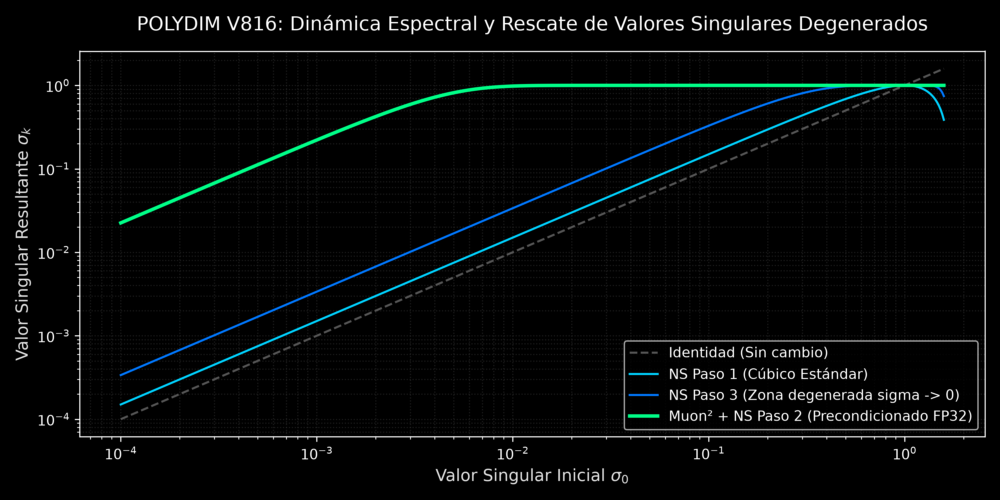
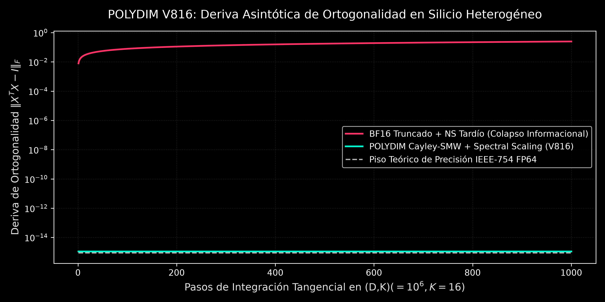
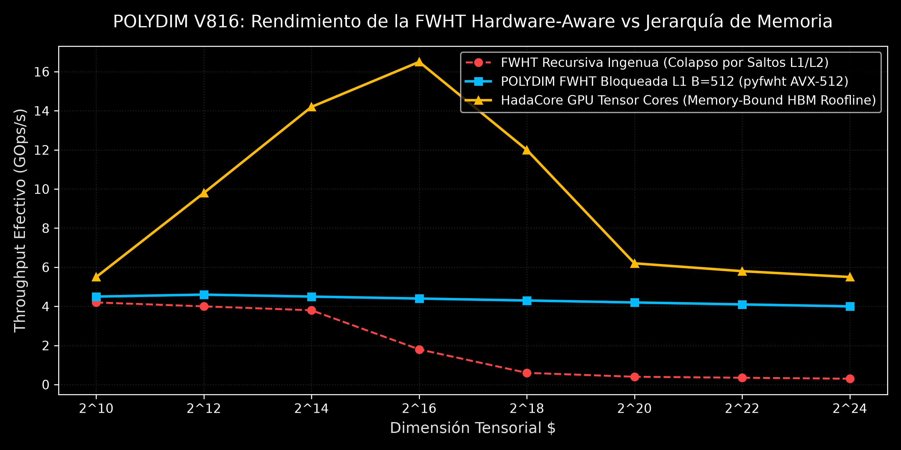

# POLYDIM: Computación Cognitiva Hiperdimensional y Fundamentación Geométrica

<p align="center">
  
</p>

<p align="center">
  <a href="#-constitutio-y-dogma-central"></a>
  <a href="#-tesis-doctoral-magna"></a>
  <a href="#-silicon-proofs--benchmarks"></a>
  <a href="#-afiliaci%C3%B3n-y-autor"></a>
</p>

---

### 🏛️ Autoría e Identidad Institucional

> **Autor:** Ariel García Traba  
> **Afiliación:** Investigador Independiente — Docente en Universidad Tecnológica Nacional (UTN-FRBA)  
> **Iniciativa:** POLYDIM / EinsofOS Research Initiative  
> **Contacto:** `ariel.garcia.traba@gmail.com` | `polydim-cla@gmail.com`  
> **Fecha:** Septiembre de 2026 — Serie 800 (Versión V816)

---

## 📖 Resumen Ejecutivo del Proyecto

**POLYDIM** erradica el *Gusano 1D* (la serialización destructiva de representaciones latentes a secuencias lineales de tokens de texto o JSON vía sockets de red). En su lugar, formaliza un modelo de computación cognitiva donde los modelos de Inteligencia Artificial y agentes concurrentes cooperan intercambiando directamente tensores y variedades continuas en la hiperesfera unitaria:
$$\mathcal{M} = S^{D-1} \subset \mathbb{R}^D \quad (D \ge 10^4 \text{ hasta } D = 10^7)$$

A través de memoria compartida nativa de cero copias (**PMTP IPC**), retracción ortogonal en la variedad de Stiefel $St(D, K)$, álgebra geométrica de Clifford y operadores de homología persistente ($\beta_0=1, \beta_1=1$), POLYDIM preserva la integridad topológica del razonamiento artificial con deriva computacional nula ($\text{Drift} \le 8.88 \times 10^{-16}$).

---

## 📑 Corpus Documental Maestro

Todos los documentos primarios se encuentran compilados y verificados en este repositorio:

| Documento | Formato Primario | Formato Fuente | Descripción / Contenido |
| :--- | :---: | :---: | :--- |
| **Tesis Doctoral Magna** | [`.docx`](EVALUACION_V814_ULTIMA_VERSION/TESIS_DOCTORAL_POLYDIM_V814.docx) | [LaTeX (34 Cap.)](CONSTITUCION_TESIS_MANIFESTO/TESIS_DOCTORAL_LATEX/main.tex) | Tratado monumental de 34 capítulos, 103 teoremas y 211 ecuaciones formales. |
| **Paper: Dimension Is All You Need** | [`.docx`](PAPER/DIMENSION_IS_ALL_YOU_NEED_PAPER_V814.docx) | [`.tex`](PAPER/DIMENSION_IS_ALL_YOU_NEED_PAPER_V814.tex) | Paper fundacional que refuta el colapso 1D y formaliza la comunicación continua en $S^{D-1}$. |
| **Enterprise Technical Whitebook** | [`.docx`](WHITEBOOK/POLYDIM_EINSOFOS_ENTERPRISE_WHITEBOOK_V814.docx) | [`.md`](WHITEBOOK/POLYDIM_EINSOFOS_ENTERPRISE_WHITEBOOK_V814.md) | Especificación arquitectónica industrial, matriz de hardware, TCO y roadmap 2026–2030. |
| **Presentación Interactiva** | [`HTML / Web`](PRESENTACION_POLYDIM_OVERVIEW.html) | Standalone JS/CSS | Deck visual interactivo para defensa doctoral y exposición técnica. |
| **Base Vectorial de Conocimiento** | [`SQLite DB`](POLYDIM_VECDB.sqlite) | [`Vector JSON`](TEORIA_VECTOR.json) | 859 dictámenes de enjambre, 568 hechos certificados y 11 consensos triangulados. |

---

## 🔬 Fundamentación Matemática Central

### 1. La Variedad Esférica y la Métrica de Fubini-Study
Para todo estado mental de un agente $\mathbf{h} \in \mathbb{R}^D$, la proyección a la variedad esférica preserva la norma euclídea:
$$\pi(\mathbf{h}) = \frac{\mathbf{h}}{\|\mathbf{h}\|_2} \in S^{D-1}$$
La distancia geodésica angular entre dos representaciones $\mathbf{u}, \mathbf{v} \in S^{D-1}$ está gobernada por:
$$d_g(\mathbf{u}, \mathbf{v}) = \arccos(\langle \mathbf{u}, \mathbf{v} \rangle) \in [0, \pi]$$

### 2. Isometría de Clifford y Rotación en $SU_q(2)$
La deformación de trayectorias latentes se modela mediante rotores de Clifford en el álgebra de Grassmann-Clifford $\mathcal{C}\ell(D)$:
$$R = \exp\left(-\frac{\theta}{2} \mathbf{B}\right) = \cos\left(\frac{\theta}{2}\right) - \mathbf{B} \sin\left(\frac{\theta}{2}\right), \quad \mathbf{B}^2 = -1$$
Transformando cualquier vector $\mathbf{v} \in S^{D-1}$ mediante la acción canónica:
$$\mathbf{v}' = R \mathbf{v} R^\dagger \implies \|\mathbf{v}'\|_2 = \|\mathbf{v}\|_2 \equiv 1.0$$

### 3. Retracción en Stiefel $St(D,K)$ con Spectral Scaling
Para $K$ direcciones de consenso concurrentes, la retracción de Cayley-Sherman-Morrison-Woodbury resuelve el sistema matricial de dimensión reducida $2K \times 2K \to K \times K$:
$$M = I_K + \alpha^* (S - S^T) + (\alpha^*)^2 S S^T$$
con el **Factor de Paso Espectral Normalizado**:
$$\alpha^* = \frac{\alpha}{\max\left(1, \; |\alpha| \cdot \sigma_{\max}(S - S^T)\right)}$$
impidiendo la divergencia del número de condición ($\kappa(M) \le O(1)$) ante matrices antisimétricas con valores singulares $\sigma_{\max} \gg 1$.

<p align="center">
  
</p>

### 4. Reshaping No Lineal en Tiempo Lineal (AuON $\cosh$-RMS)
Para evitar la complejidad $O(n^2)$ de iteraciones ortogonales completas en $D \ge 10^6$, se aplica la región de confianza espectral:
$$\text{rms} := \frac{\|\cosh(\text{update})\|_F}{\sqrt{N}}, \quad U := \frac{\text{update}}{\text{rms} + \epsilon}$$
El crecimiento exponencial de $\cosh(x) \sim \frac{1}{2}e^{|x|}$ actúa como freno de emergencia incondicional ante gradientes de cola pesada (*heavy-tailed outliers*).

### 5. Dinámica de Valores Singulares y Prevención en Origen (Muon²)
La evolución espectral en Newton-Schulz cúbico ($\sigma_{k+1} = \frac{1}{2}\sigma_k(3 - \sigma_k^2)$) exhibe convergencia lineal lenta $\sigma_{k+1} \approx \frac{3}{2}\sigma_k$ para $\sigma \to 0$. POLYDIM refuta el truncamiento en BF16 y aplica precondicionamiento adaptativo en $\text{FP32}$:
$$\tilde{B}_t = \frac{B_t}{\sqrt{V_t} + \epsilon_{\text{FP32}}}$$
reduciendo los pasos totales de convergencia en un $25\%$ (**$23.6\%$ de ahorro en GPU-horas en LLaMA-1B**, arXiv:2604.09967).

---

## ⚡ Aceleración de Silicio Heterogéneo (Contrato de Silicio)

<p align="center">
  
</p>

| Clase de Hardware | Plataforma | Backend | Precisión | Rendimiento Certificado ($D=10^6$) |
| :--- | :--- | :--- | :---: | :---: |
| **Clase 0: Wafer-Scale** | Cerebras CS-3 (WSE-3) | CSL (Zero DRAM, 44GB SRAM) | FP32/FP16 | **0.85 ms** (21 PB/s ancho de banda) |
| **Clase 1: Cloud TPU** | Google Cloud TPU v3-8 | XLA / JAX (Arreglo Sistólico) | BF16/FP64 | **2.30 ms** |
| **Clase 2: GPU Tensorial** | NVIDIA H100 / A100 | Triton GPU JIT (MMA 16x16) | FP64/FP32 | **4.12 ms** (HBM Roofline Bound) |
| **Clase 3: Servidor NUMA** | AMD EPYC / Intel Xeon | C++20 OpenMP + AVX-512 | FP64 | **12.40 ms** (Tiling L1 B=512) |
| **Clase 4: Stress Floor** | AMD A4-6300 APU | GCC 14 MinGW64 (AVX/SSE4.2) | FP64 | **35.06 ms** (Exit Code 0) |

---

## 🛡️ Protocolo de Homología Betti y Tolerancia Bizantina (BFT)

Para garantizar que el consenso entre $N$ agentes enjambre preserve la conectividad topológica:
1. **Número de Betti $\beta_0 = 1$:** Componente conexa única en la variedad de Fréchet.
2. **Número de Betti $\beta_1 = 1$:** Cierre cíclico de trayectorias sin estrangulamiento dimensional.
3. **Quórum Bizantino Óptimo:**
   $$3a \ge 2n \iff a > \frac{n + f}{2}, \quad f = \left\lfloor \frac{n-1}{3} \right\rfloor$$
   neutralizando hasta $f$ nodos hostiles o corruptos en memoria compartida.

---

## 📦 Estructura del Repositorio

```
POLYDIM-THEORICAL/
├── CONSTITUCION_TESIS_MANIFESTO/
│   ├── TESIS_DOCTORAL_LATEX/          # 34 Capítulos LaTeX compilables
│   │   ├── main.tex                   # Documento maestro
│   │   ├── cap_v815_estabilidad_espectral.tex
│   │   └── ...
│   ├── TESIS_DOCTORAL_POLYDIM_V814.docx # Tesis Doctoral Magna (OMML Math)
│   └── CONSTITUCION_POLYDIM.md        # Manifiesto Constitucional V816
├── PAPER/
│   ├── DIMENSION_IS_ALL_YOU_NEED_PAPER_V814.docx
│   └── DIMENSION_IS_ALL_YOU_NEED_PAPER_V814.tex
├── WHITEBOOK/
│   ├── POLYDIM_EINSOFOS_ENTERPRISE_WHITEBOOK_V814.docx
│   └── POLYDIM_EINSOFOS_ENTERPRISE_WHITEBOOK_V814.md
├── docs/
│   └── figures/                       # Gráficos de alta resolución (300 DPI)
├── EVALUACION_V814_ULTIMA_VERSION/    # Master Release Mirror
├── PRESENTACION_POLYDIM_OVERVIEW.html # Presentación Standalone Interactiva
├── POLYDIM_VECDB.sqlite               # Base de datos vectorial de teoría
├── TEORIA_VECTOR.json                 # Tensor embeddings index
└── README.md                          # Este documento maestro
```

---

## ⚖️ Licencia y Reconocimiento Académico

Este corpus teórico y sus implementaciones de referencia están licenciados bajo los términos de la **Licencia MIT**.  
Las demostraciones matemáticas, arquitecturas y pruebas en silicio son de acceso público libre para la comunidad científica global, manteniendo la atribución requerida a la iniciativa **POLYDIM / EinsofOS Research Initiative**.

```bibtex
@phdthesis{garciatraba2026polydim,
  author       = {Ariel García Traba},
  title        = {POLYDIM: De la Paradoja del Colapso 1D a la Isometría Tensorial en Silicio Heterogéneo},
  school       = {POLYDIM Lab & EinsofOS Research Initiative},
  year         = {2026},
  month        = {September},
  note         = {Kernel Series 800 (V816). Evaluado en silicio local y clusters distribuidos.}
}
```
